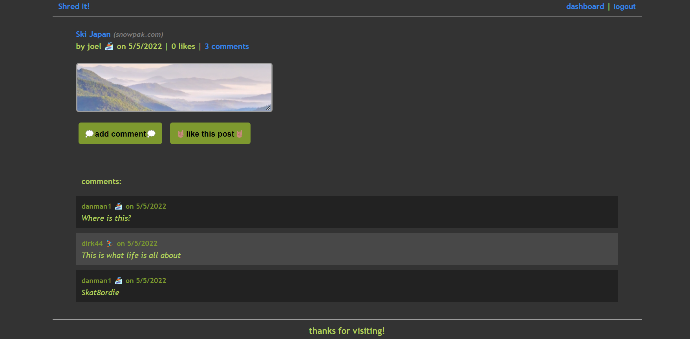
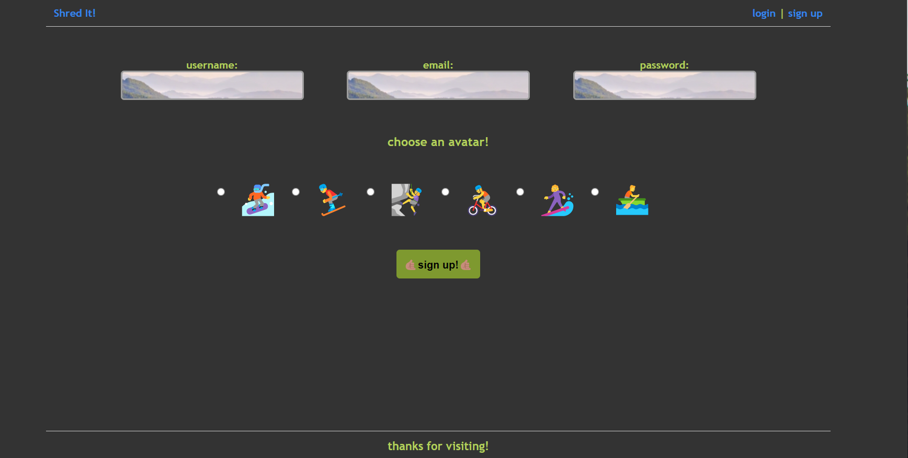

# Shred It!

## Table of Contents:

- [Description](#description)
- [Repo-link](#repo-link)
- [Features](#features)
- [Contributors](#contributors)

## Description:

Shred-It! is a forum for outdoor and extreme sports enthusiasts.

## Features:

- Forums/discussion boards with links to various topics
- Creating personalized posts with links to source
- Liking and commenting platform
- Personal profiles, usernames, and icons related to outdoor interests

## Links:

Github repo: [Github-Link](https://github.com/joelcutler/group-project-2pp.com)
Deployed link: [Deployed-Link](https://shred-it.herokuapp.com)

## Tehcnologies Used

- bcrypt
- sequelize/mysql
- dotenv
- express
- prettier/eslint
- node.js

## Contributors:

Joel C, Julie T, Cade W, Brandon F
